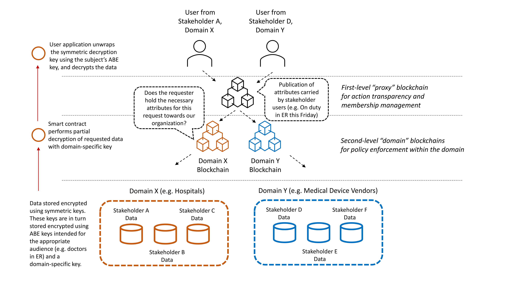

The **Janus** platform allows stakeholders from different domains
that have a shared interest in sensitive data or critical functions,
to securely access these, in a manner that is auditable by any
stakeholder. Organizations that are stakeholders, may establish
policies for the automatic access to their systems and information, based on
a requester's characteristics. Such characteristics may be dynamically
appointed to a subject by the subject's affiliated stakeholder.
Moreover, it is possible for stakeholders of a given domain to establish
a domain-wide access policy.

The platform is based on an HMBAC (hierarchical multi-blockchain access control) system, where subjects
use ABE (Attribute-Based Encryption) keys to gain access to information. Please note that subject access to the platform
requires user authentication through credentials that are not related
to the ABE keys, and which can be easily revoked if required. The following 
diagram provides a high level overview of the platform.

The demo environment found in this repository, showcases
a deployment made by a fictional governmental
organization to coordinate access to patient medical records and deployed
medical devices (in hospitals). Stakeholders in this example scenario are grouped into
two domains: the hospital organizations (some of which also act as
research institutes) and medical device vendors. Each domain operates
its own blockchain for domain-applicable requests for information. For
example, the hospital domain blockchain serves requests made for
patient information, while the device vendor blockchain serves requests
regarding the status of medical devices (e.g. firmware availability, fault statistics etc.).
To enable stakeholders from different domains to be able to audit any event,
an additional blockchain is introduced to track requests regardless
of the domain this was initiated upon. This extra blockchain also tracks
membership-related information of the aforementioned ecosystem.

The **Janus** project is a reference implementation of the platform proposed
in the ["A hierarchical multi blockchain for fine
grained access to medical data"](https://ieeexplore.ieee.org/stamp/stamp.jsp?tp=&arnumber=9146294) paper by Vangelis Malamas, Panayiotis Kotzanikolaou, Thomas K. Dasaklis and Mike Burmester.
CENSUS was tasked with the implementation of this
platform as part of the "MELITY" national research project (ΜΕΛΙΤΥ,
Κωδικός Έργου: Τ1ΕΔΚ-01958, Δράση “Ερευνώ – Δημιουργώ – Καινοτομώ”
του Επιχειρησιακού Προγράμματος ΕΠΑνΕΚ 2014-2020
“Ανταγωνιστικότητα – Επιχειρηματικότητα – Καινοτομία”).

The **Janus** platform is available for use under the 2-clause BSD license (see **LICENSE**).

- For installation instructions, see **setup.md**
- For the available **requests** of the System and **clients** that you may use to construct a request, please read the **demo.md** file.
- For the instructions on how to run a Benchmark, please read the **benchmark.md** file.
- For Frequently Asked Questions, see **faq.md**

Any mention to actual organization names in the demo data is unintended. Demo data were generated for platform demonstration purposes only. Any such mentions do not imply any endorsement of the platform by these organizations.
